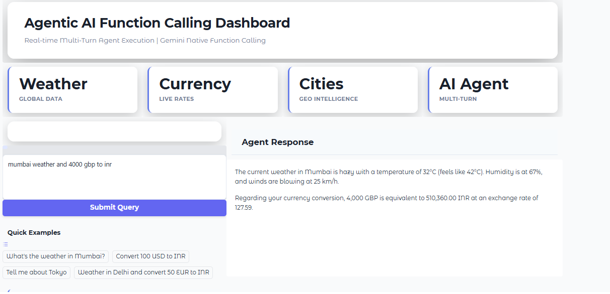

# Agentic AI Function Calling Dashboard

A professional enterprise-grade dashboard demonstrating multi-turn agentic AI with Google Gemini's native function calling capabilities.

## Overview

This project showcases real-time AI agent execution with live API integrations for weather data, currency conversion, and geographic intelligence. Built with Python, Gradio, and Google Gemini AI.

## Features

- **Multi-Turn Agent Execution**: Autonomous AI agent that can chain multiple tool calls to solve complex queries
- **Real-Time Weather Data**: Global weather information powered by wttr.in API
- **Live Currency Conversion**: Exchange rates with special support for Indian Rupees (INR)
- **City Intelligence**: Geographic and demographic information for major cities
- **Professional UI**: Modern gradient design with enterprise-grade styling

## Screenshots



## Architecture

### AI Agent System
- **Model**: Google Gemini Flash Lite
- **Pattern**: Native Function Calling
- **Execution**: Multi-turn agentic loop with automatic tool selection

### Integrated Tools
1. **get_live_weather()** - Real-time weather data from wttr.in
2. **convert_currency()** - Live exchange rates from ExchangeRate-API
3. **get_city_info()** - City metadata (timezone, language, currency)

## Installation

### Prerequisites
- Python 3.8+
- Google Gemini API Key

### Setup

1. Clone the repository:
```bash
git clone https://github.com/SrinathMLOps/AgenticAIEngineering.git
cd AgenticAIEngineering/Day2_PromptEngineering
```

2. Install dependencies:
```bash
pip install -r requirements.txt
```

3. Configure API key:
```bash
# Create .env file
cp .env.template .env

# Add your Gemini API key to .env
GEMINI_API_KEY=your_api_key_here
```

## Usage

### Run the Professional Dashboard
```bash
python professional_enterprise_dashboard.py
```

Access the dashboard at: http://127.0.0.1:7863

### Example Queries
- "What's the weather in Mumbai?"
- "Convert 100 USD to INR"
- "Tell me about Tokyo"
- "Weather in Delhi and convert 50 EUR to INR"

## Project Structure

```
Day2_PromptEngineering/
├── beginner/
│   ├── lesson_01_build_attention.py
│   └── lesson_02_prompt_harness.py
├── intermediate/
│   ├── lesson_03_agentic_loop.py
│   ├── lesson_04_position_ablation.py
│   └── lesson_07_json_prompting.py
├── advanced/
│   ├── lesson_05_multi_agent.py
│   ├── lesson_06_attention_viz.py
│   └── lesson_08_adk_structured_prompting.py
├── professional_enterprise_dashboard.py
├── dashboard.html
├── requirements.txt
├── .env.template
└── README.md
```

## Technologies Used

- **Python**: Core programming language
- **Gradio**: Web UI framework
- **Google Gemini API**: AI language model with function calling
- **wttr.in**: Weather data API
- **ExchangeRate-API**: Currency conversion API

## Key Concepts Demonstrated

### 1. Multi-Turn Agentic AI
The agent autonomously decides which tools to call and in what sequence to answer complex queries.

### 2. Native Function Calling
Uses Gemini's built-in function calling rather than prompt engineering or external frameworks.

### 3. Tool Chaining
Agent can chain multiple tool calls together (e.g., get city info → check weather → convert currency).

### 4. Real-Time Data Integration
All APIs provide live, up-to-date information rather than mock data.

## Design Highlights

- **Gradient Background**: Purple gradient (#667eea to #764ba2)
- **White Floating Cards**: Elevated design with shadows
- **Responsive Layout**: Adapts to different screen sizes
- **Professional Typography**: Clean, readable fonts
- **Interactive Elements**: Hover effects and smooth transitions

## API Keys Required

- **Google Gemini API**: Get your key from [Google AI Studio](https://makersuite.google.com/app/apikey)

## Contributing

Contributions are welcome! Please feel free to submit a Pull Request.

## License

This project is part of the Agentic AI Engineering learning series.

## Author

**Srinath**
- GitHub: [@SrinathMLOps](https://github.com/SrinathMLOps)
- Repository: [AgenticAIEngineering](https://github.com/SrinathMLOps/AgenticAIEngineering)

## Acknowledgments

- Google Gemini API for function calling capabilities
- wttr.in for weather data
- ExchangeRate-API for currency conversion

---

**Note**: This is an educational project demonstrating agentic AI patterns and multi-turn agent execution with real-world API integrations.
